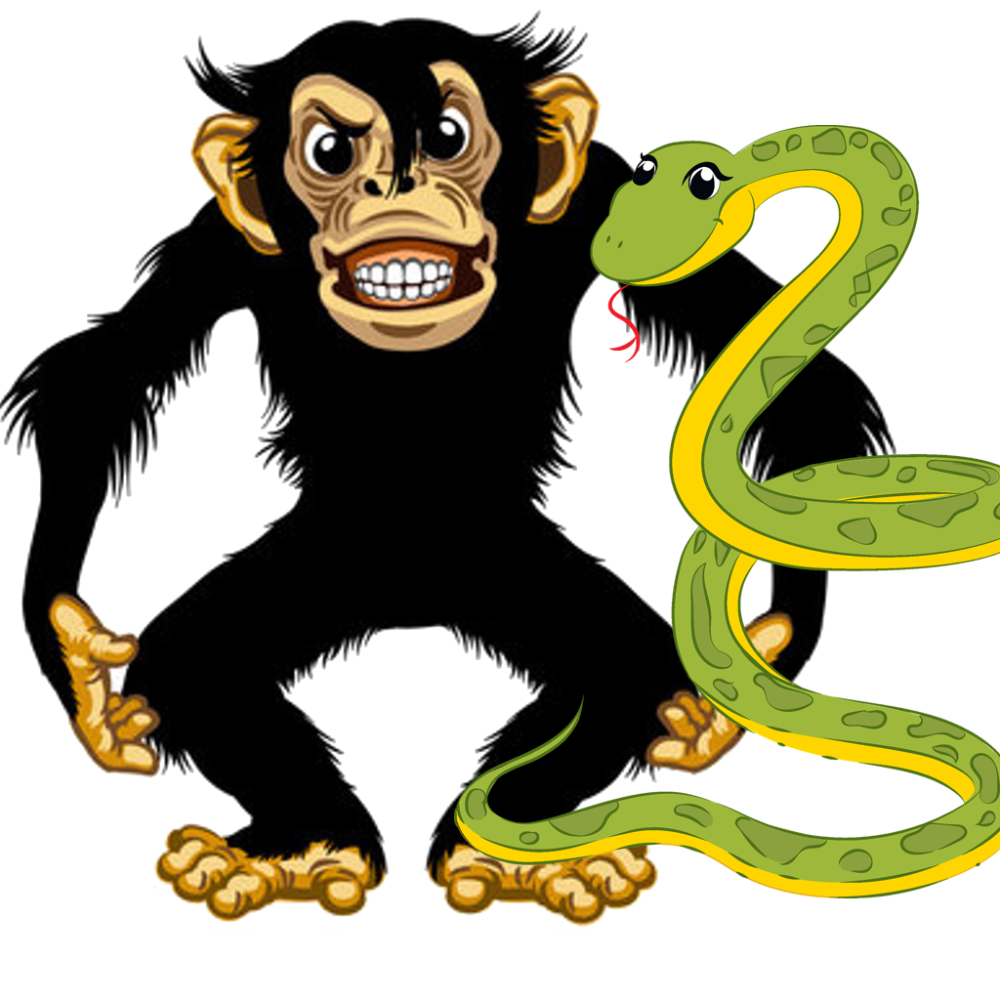

# Snake

Klasyczna gra typu snake tworzona w Pythonie.


<!-- Zakomentowane sekcje będzie trzeba uzupełnić gdy będziemy mieli już stworzoną templatkę projektu
## Getting Started

These instructions will get you a copy of the project up and running on your local machine for development and testing purposes. See deployment for notes on how to deploy the project on a live system.

### Prerequisites

What things you need to install the software and how to install them

```
Give examples
```

### Installing

A step by step series of examples that tell you how to get a development env running

Say what the step will be

```
Give the example
```

And repeat

```
until finished
```

End with an example of getting some data out of the system or using it for a little demo

## Deployment

Add additional notes about how to deploy this on a live system
-->

## Użyte technologie

- [Pygame](https://www.pygame.org/) - Zestaw modułów usprawniających tworzenie gier

## Wersjonowanie

Używamy [SemVer](http://semver.org/) do wersjonowania. Dostępne wersje można znaleźć w sekcji z [tagami tego repozytorium](https://github.com/your/project/tags).

## Autorzy

- **Filip Brodacz** - [Bursaa](https://github.com/Bursaa)
- **Piotr Błędowski** - [piotr-bledowski-student](https://github.com/piotr-bledowski-student)
- **Michał Karpierz** - [ShatterPlayer](https://github.com/ShatterPlayer)
- **Krzysztof Nikodem** - [knikodemQ](https://github.com/knikodemQ)
- **Kacper Poznański** - [k-poznanski](https://github.com/k-poznanski)
- **Kacper Machnik** - [KacperMachnik](https://github.com/KacperMachnik)

## Licencja

Kod źródłowy projektu jest objęty licencją MIT - zobacz [LICENSE.md](LICENSE.md) by dowiedzieć się więcej.

## Grafika

Podstawowa, inspirowana pierwszymi wydaniami Snake oraz Blockade.
